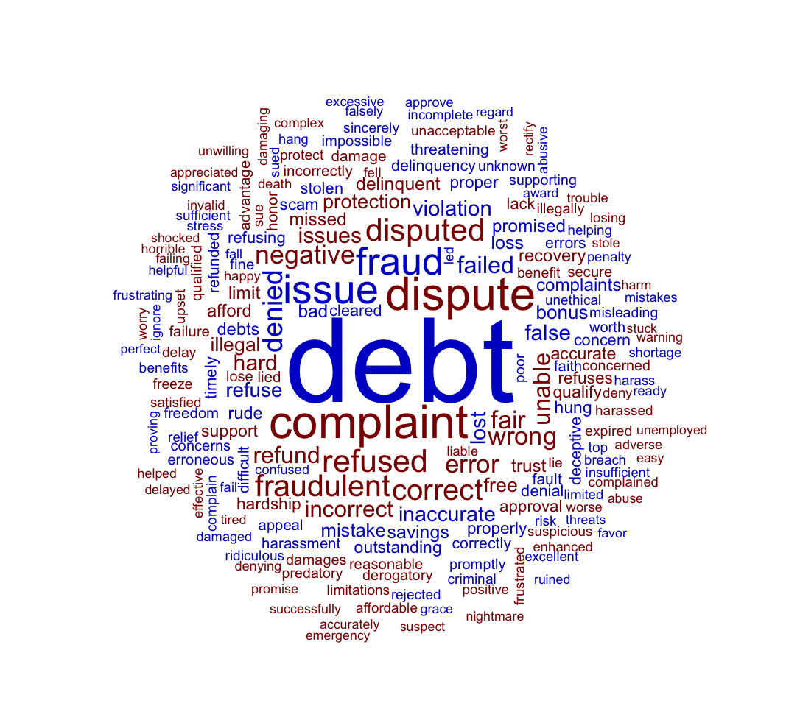

# Complain-Sentiment-analysis

## Introduction
We will analyze the consumer complain text data for relations between.......... <br>

## Dictionary 📖
The columns that were used are: 
1. Product
2. Complain
3. Company
   
---
## Data Cleaning 🧹
1. Filter out blank and responseless complaints
   -This was nessesary so my table was more readable and easy for analysis.
 ```
   df_complaints <- df_complaints %>%
  filter(Consumer.complaint.narrative != "" & Company.public.response != "")
```
3. Rename the complaint column
   -I renamed the customer complaint narrative column to just Complain so its simplified to write.
  ```
 df_complaints <- df_complaints %>%
  rename(Complain = Consumer.complaint.narrative)
```
4. Create new table
   -Table contains Product, Complain, and Company columns

  ```
new_table <- df_complaints %>%
  select(Product, Complain, Company)
```

3. Load stop words
   -to remove common words
```   
data("stop_words")

```
4.Clean the text

```
     mutate(Complain = str_replace_all(Complain, "[[:punct:]]", "") %>%
         str_remove_all("\\d+") %>%
         str_squish()) %>%
  # Tokenize the complaints into individual words after cleaning
tidy_complaints <- new_table %>%
  unnest_tokens(word, Complain) %>%
  # Remove stop words, unnecessary characters, single characters, and numbers
  anti_join(stop_words, by = "word") %>%
  filter(!grepl("[^[:alnum:][:space:]]", word)) %>%
  filter(nchar(word) > 1) %>%
  filter(!grepl("\\d+", word))
```
## Data Summary


## Data Analysis
1. Common joy words in products
   -

   
3. Negative and positive sentiment in separate columns
   -
   <div align = "center">
   
   </div>

   
4. Comparing the three sentiment dictionaries
   -

   
6. Visualizing the estimate of the net sentiment (positive - negative)
   -
   
7. Joining the complaints data with the sentiment lexicon
   -

   
9. Found the sentiment score for each company
   -

   
11. How many positive and negative words are in these lexicons.

   -
   
12. To answer the most negative wod reciveing Products in the company.
    -

    
14. Plot top companies with negative sentiments
   -the plot highlights the top 20 compaies that have the highest negative sentiment count.
<div align = "center">

</div>


10. Plot top companies with positive sentiments
   -the plot highlights the top 20 compaies that have the highest positive sentiment count.
<div align = "center">

</div>


11. Get the frequency of the positive and negative sentiments.
   -


11. Plot positive and negative sentiments separately
   -
<div align = "center">

</div>


<div align = "center">

</div>


13. Creating word cloud with word sizes based on frequency
   -Used the frequency if the words to determine the size.
<div align = "center">

</div>


##Conclusion
--
